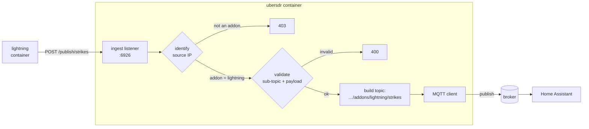

# Publishing to MQTT from an UberSDR addon

UberSDR addons run as separate containers on the `sdr-network`. They have no MQTT
credentials, no broker address, and no way to reach the operator's broker
directly — and they shouldn't have any of those things, because an addon is not
the receiver and shouldn't be able to speak for it.

This document describes the ingest port that lets an addon publish its own events
through the receiver's existing MQTT connection, and optionally have those events
appear in Home Assistant as first-class entities.

**Operators need to configure nothing.** When MQTT is enabled on the receiver,
the ingest listener runs, and every enabled addon in `addons.yaml` is permitted
automatically. Installing your addon is the whole setup.

---

## Contents

- [Quick start](#quick-start)
- [How it works](#how-it-works)
- [Security model](#security-model)
- [Publishing data](#publishing-data)
- [Home Assistant entities](#home-assistant-entities)
- [Availability](#availability)
- [A complete addon](#a-complete-addon)
- [Lifecycle](#lifecycle)
- [Reference](#reference)
- [Troubleshooting](#troubleshooting)
- [Operator settings](#operator-settings)

---

## Quick start

From inside your addon container:

```sh
curl -X POST http://ubersdr:6926/publish/strikes \
     -H 'Content-Type: application/json' \
     -d '{"count": 42, "last_km": 18.3}'
```

```json
{
  "status": "published",
  "topic": "ubersdr/metrics/addons/lightning/strikes",
  "qos": 1,
  "retain": false,
  "bytes": 30
}
```

That's it. No credentials, no broker address, no configuration on either side.

Before writing any code, confirm the receiver recognises you:

```sh
curl http://ubersdr:6926/health
```

```json
{
  "addon": "lightning",
  "mqtt_connected": true,
  "topic_prefix": "ubersdr/metrics/addons/lightning/{sub_topic}",
  "status_topic": "ubersdr/metrics/addons/lightning/status",
  "ha_discovery": true,
  "max_payload_bytes": 65536,
  "rate_limit": 120,
  "max_qos": 1,
  "retain_allowed": true,
  "max_entities": 20,
  "offline_after_sec": 300
}
```

`"addon"` is the name UberSDR resolved you to. Every topic you can reach is
namespaced under it. If this returns `403`, see
[Troubleshooting](#troubleshooting).

---

## How it works

You make an HTTP request to `ubersdr:6926`. UberSDR works out who you are from
the TCP connection itself, builds a topic under your namespace, validates your
payload, and publishes it on its own MQTT client.



The important structural point: **the topic is constructed inside UberSDR from a
name you did not supply**. You contribute the tail of the topic and the payload.
Everything that determines *whose* namespace it lands in comes from the socket.

### Topic layout

| Topic | Written by | Purpose |
|---|---|---|
| `{prefix}/{ns}/{addon}/{sub_topic}` | you | your data |
| `{prefix}/{ns}/{addon}/status` | UberSDR | your availability (`online`/`offline`) |
| `{prefix}/status` | UberSDR | the receiver's availability (MQTT Last Will) |
| `{ha_prefix}/{component}/{node}/…/config` | UberSDR | Home Assistant discovery |

`{prefix}` is the operator's `mqtt.topic_prefix` (default `ubersdr/metrics`) and
`{ns}` is `addons`. So a typical data topic is:

```
ubersdr/metrics/addons/lightning/strikes
```

You can only write to the first row. The other three are UberSDR's.

---

## Security model

An addon is third-party code running next to the receiver. The design assumes an
addon may be buggy or actively hostile, and constrains it structurally rather
than by convention.

### 1. The port is not routable from outside

The listener binds a port that is deliberately **not** in the `ports:` list of
`docker-compose.yml`, so it is reachable from the `sdr-network` but not from the
internet.

This is treated as a hardening measure, not as the security boundary — on Linux
the Docker host can route to the bridge subnet directly. The real boundary is the
next layer.

### 2. Your identity comes from the socket

UberSDR reads the **raw TCP source address** of your connection and matches it
against the container hostnames of the installed addons.

`X-Forwarded-For` and `X-Real-IP` are deliberately ignored on this port. The
usual client-IP helper honours them, and using it here would let any addon
impersonate any other by setting a header.

What follows from this:

- You never send your addon name. There is no field for it, and one in the body
  would be ignored.
- You cannot publish into another addon's namespace, and no one can publish into
  yours.
- There is no token or password to provision, rotate, or leak.
- If your container is renamed or removed from `addons.yaml`, access stops.

### 3. You cannot name a topic

This is the layer that matters most. Addons supply a *sub-topic tail*, never a
topic. UberSDR places it under `{prefix}/{ns}/{addon}/`.

The validator applies to both the data path and Home Assistant declarations —
literally the same function — so an entity can never reference a topic you are
not allowed to publish to.

```
^[a-z0-9][a-z0-9_-]*(/[a-z0-9][a-z0-9_-]*)*$
```

Lowercase alphanumeric segments separated by single slashes. Max 64 characters
and 4 segments. The charset excludes `+`, `#` and `.`, so MQTT wildcard injection
and dot-segment traversal are impossible by construction rather than by
blocklist. `status` is reserved because UberSDR owns it.

| Accepted | Rejected | |
|---|---|---|
| `strikes` | `Strikes` | uppercase |
| `bands/40m` | `/strikes` | leading slash |
| `stats/hourly/count` | `bands/+` | MQTT wildcard |
| `sferic-rate` | `../metrics/noisefloor` | traversal |
| `snr_db` | `status` | reserved |

### 4. Declarations are typed, not passed through

Home Assistant declarations are decoded into a Go struct with a fixed field set.
Anything else in your JSON is dropped at decode time — not rejected, just absent.

There is no `state_topic`, `availability_topic`, `unique_id`, `object_id` or
`device` field on that struct, so those cannot be supplied even in principle.
UberSDR computes all of them from your authenticated identity.

This is what stops an addon from pointing an entity at the receiver's own topics,
hijacking another addon's entity, or writing into the shared Home Assistant
discovery tree — a tree that also contains the operator's thermostats and door
sensors.

### 5. Everything else is bounded

Payload size, publish rate, QoS, retain, and entity count all have caps. See
[Reference](#reference).

### What an addon still can do

Be honest about the residual surface:

- Publish arbitrary JSON within its own namespace, at up to the rate limit.
- Occupy up to `max_entities` Home Assistant entities under its own device.
- Set retained messages within its namespace (if the operator allows retain),
  which persist until cleared.
- Provide a Jinja `value_template` that Home Assistant evaluates. HA's template
  sandbox has no filesystem or network access, but it can read other entity
  states. Templates are length-capped; that is the extent of the mitigation.

None of these let an addon affect the receiver, other addons, or unrelated Home
Assistant devices.

---

## Publishing data

```
POST   http://ubersdr:6926/publish/{sub_topic}
DELETE http://ubersdr:6926/publish/{sub_topic}
```

### Payload

Must be **valid JSON**, or clean UTF-8 text if you send
`Content-Type: text/plain`. Control characters are rejected in both cases. This
keeps binary junk off the broker and keeps payloads in a shape Home Assistant
templates can parse.

An object is almost always the right choice — it leaves room to add fields later
without breaking subscribers:

```json
{"count": 42, "last_km": 18.3, "peak_snr_db": 24.1}
```

A bare scalar is valid JSON and works fine for single values:

```sh
curl -X POST http://ubersdr:6926/publish/snr_db \
     -H 'Content-Type: application/json' -d '24.1'
```

### Query parameters

| Parameter | Default | Notes |
|---|---|---|
| `qos` | operator's max (usually `1`) | Clamped down to `max_qos`, never up |
| `retain` | `false` | Ignored entirely if the operator disabled retain |

Use `retain=true` for *state* — a current reading, a status summary — so a
subscriber that connects later immediately sees the latest value. Leave it off
for *events*, where replaying a stale one is wrong.

```sh
curl -X POST 'http://ubersdr:6926/publish/summary?retain=true&qos=1' \
     -H 'Content-Type: application/json' \
     -d '{"strikes_today": 1284, "active": true}'
```

### Clearing a retained topic

Publishing `null` does **not** clear a retained message — only a zero-length
payload removes one from a broker, and the ingest port rejects empty bodies.
Use `DELETE`:

```sh
curl -X DELETE http://ubersdr:6926/publish/summary
```

```json
{"status": "cleared", "topic": "ubersdr/metrics/addons/lightning/summary"}
```

### Rate limiting

120 publishes per minute per addon by default, token bucket — so a burst of 120
is fine, and the bucket refills at 2/second. Exceeding it returns `429`.

If you have high-frequency data, aggregate before publishing. One message per
second carrying a summary is better than sixty carrying individual events, both
for the limit and for anything subscribing.

### Response codes

| Code | Meaning | What to do |
|---|---|---|
| `200` | Published | — |
| `400` | Bad sub-topic or payload | Fix and don't retry; the body says what's wrong |
| `403` | Not a recognised addon container | See [Troubleshooting](#troubleshooting) |
| `405` | Wrong method | Use `POST`, or `DELETE` to clear |
| `413` | Payload too large | Reduce or split |
| `429` | Rate limited | Back off |
| `503` | Broker unreachable | Transient — retry with backoff |

`503` is the one to handle properly. The receiver's broker connection can drop
and reconnect; your addon should treat that as normal and not crash or spin.

---

## Home Assistant entities

If the operator has Home Assistant discovery enabled, you can turn your data into
real HA entities — with units, graphs, history, and automation triggers.

### Concepts

Publishing data and appearing in Home Assistant are two different things.
Publishing puts bytes on a topic; HA ignores it entirely until something
publishes a *discovery config* telling HA that an entity exists and where its
state comes from.

Addons don't write discovery configs. You **declare** an entity — describing it
in presentation terms — and UberSDR publishes the discovery config for you,
computing every field that carries identity or addressing.

### Your Home Assistant device

Each addon appears as its own **device**, linked to the receiver via
`via_device`, so Home Assistant nests it under the parent receiver:

```
UberSDR M9PSY                      ← the receiver
├── UberSDR M9PSY Lightning        ← your addon
│   ├── sensor.ubersdr_addon_lightning_strikes
│   └── sensor.ubersdr_addon_lightning_peak_snr
└── UberSDR M9PSY Doppler
    └── sensor.ubersdr_addon_doppler_shift_hz
```

Your device card carries your own version and description, and a
`configuration_url` that links straight through to your addon's web UI at
`/addon/{name}/`. That's derived from the receiver's public URL and your addon
name — you don't supply it.

### Declaring an entity

```sh
curl -X POST http://ubersdr:6926/discovery \
     -H 'Content-Type: application/json' \
     -d '{
       "sub_topic": "strikes",
       "component": "sensor",
       "name": "Strike Count",
       "value_template": "{{ value_json.count }}",
       "unit_of_measurement": "strikes",
       "state_class": "measurement",
       "icon": "mdi:flash",
       "addon_version": "1.4.0",
       "addon_model": "VLF lightning sferic detector"
     }'
```

```json
{
  "status": "declared",
  "state_topic": "ubersdr/metrics/addons/lightning/strikes",
  "entity_id": "sensor.ubersdr_addon_lightning_strikes"
}
```

**Declare on every startup.** It's an idempotent upsert keyed on `sub_topic`, so
re-declaring an unchanged entity is a no-op, and changing a field updates it in
place without disturbing its history.

### Several entities from one payload

Publishing one topic per value works, but it's usually wrong: it burns rate
limit, multiplies retained topics, and splits a single logical reading across
several messages that can arrive out of step.

The better shape is one retained payload with several entities pulling different
fields out of it. Add an `entity_key` to tell them apart:

```json
{"sub_topic": "summary", "entity_key": "rate",  "component": "sensor",
 "name": "Strike Rate",  "value_template": "{{ value_json.per_hour }}"}

{"sub_topic": "summary", "entity_key": "snr",   "component": "sensor",
 "name": "Last SNR",     "value_template": "{{ value_json.snr_db }}"}
```

Both read `…/addons/lightning/summary`; they become
`sensor.ubersdr_addon_lightning_rate` and `sensor.ubersdr_addon_lightning_snr`.
One publish updates both.

`entity_key` is a single lowercase segment (no slashes), max 32 characters. Omit
it when a sub-topic backs exactly one entity — then the sub-topic names the
entity, and you never need to think about this.

### A binary sensor

```json
{
  "sub_topic": "storm_active",
  "component": "binary_sensor",
  "name": "Storm Nearby",
  "value_template": "{{ 'ON' if value_json.within_50km else 'OFF' }}",
  "device_class": "problem",
  "icon": "mdi:weather-lightning"
}
```

`payload_on` / `payload_off` default to `ON` / `OFF`, which is what the template
above emits.

### Attaching extra attributes

`json_attributes_template` pulls additional fields out of the same payload and
attaches them to the entity, where they're visible in HA and usable in
automations:

```json
{
  "sub_topic": "strikes",
  "component": "sensor",
  "name": "Strike Count",
  "value_template": "{{ value_json.count }}",
  "json_attributes_template": "{{ {'nearest_km': value_json.last_km, 'peak_snr': value_json.peak_snr_db} | tojson }}",
  "unit_of_measurement": "strikes",
  "state_class": "measurement"
}
```

### Removing an entity

```sh
# every entity backed by this sub-topic
curl -X DELETE http://ubersdr:6926/discovery/summary

# just one of them
curl -X DELETE 'http://ubersdr:6926/discovery/summary?entity_key=snr'
```

You rarely need this — uninstalling your addon cleans up everything
automatically. Use it when you rename or retire a topic within a live addon, so
the old entity doesn't linger.

### What you may declare

| Field | Required | Notes |
|---|---|---|
| `sub_topic` | yes | Which of your data topics backs this entity |
| `entity_key` | no | Distinguishes entities sharing one `sub_topic`; single lowercase segment, max 32 chars |
| `component` | yes | `sensor` or `binary_sensor` only |
| `name` | yes | Display name within your device card, max 64 chars |
| `value_template` | no | Jinja, max 256 chars |
| `unit_of_measurement` | no | Max 16 chars |
| `device_class` | no | Must be a real HA device class |
| `state_class` | no | `measurement`, `total`, `total_increasing`; `sensor` only |
| `icon` | no | `mdi:` icons only |
| `entity_category` | no | `diagnostic` only |
| `payload_on` / `payload_off` | no | `binary_sensor` only; default `ON` / `OFF` |
| `json_attributes_template` | no | Jinja, max 256 chars |
| `addon_version` | no | Your version — shown on your device card |
| `addon_model` | no | Your description — shown on your device card |

Two rejections that commonly surprise people:

- **An unrecognised `device_class` is an error**, not a warning. Home Assistant
  silently discards a whole discovery config carrying one, so rejecting it here
  gives you a message instead of a mystery.
- **Writeable components are not offered.** `switch`, `number`, `button` and
  friends imply Home Assistant publishing *back* to a command topic, which needs
  subscribe support that doesn't exist. Sensors only.

### Entity naming

You don't choose entity IDs, but it's worth knowing the scheme:

```
unique_id   ubersdr_m9psy_addon_lightning_strikes    ← callsign-scoped, globally unique
entity_id   sensor.ubersdr_addon_lightning_strikes   ← callsign-free, dashboard-portable
```

`unique_id` includes the callsign so two receivers feeding one Home Assistant
never collide. `entity_id` deliberately omits it so a shared dashboard can
reference your entity without hardcoding anyone's callsign.

The trailing part is your `entity_key` when you set one, otherwise your
`sub_topic`. Note that `/` and `-` both become `_`, so `bands/40m` and
`bands_40m` produce the same ID — as would an `entity_key` of `rate` and a bare
`sub_topic` of `rate`. Any such collision is rejected with an explanation rather
than silently overwriting the existing entity.

---

## Availability

UberSDR maintains a retained status topic on your behalf:

```
ubersdr/metrics/addons/lightning/status   →   "online" | "offline"
```

You never publish to it. It flips to `online` when you publish, and to `offline`
after `offline_after_sec` (default 300) with no publishes from you.

Your Home Assistant entities require **both** the receiver's status and your
status to read `online`. That covers two genuinely different failures:

| Situation | Receiver status | Your status | Entity shows |
|---|---|---|---|
| Everything up | `online` | `online` | live value |
| Receiver down | `offline` (Last Will) | stale | unavailable |
| Your addon down, receiver up | `online` | `offline` (staleness) | unavailable |

Without the second row, a dead addon's last reading would sit in Home Assistant
looking current indefinitely. The broker's Last Will tracks *UberSDR*, not you —
you're not the MQTT client — so the staleness timer is what closes that gap.

**If you publish less often than every 5 minutes**, publish a heartbeat or ask
the operator to raise `offline_after_sec`. Otherwise your entities will flap
between available and unavailable.

After a receiver restart you get a full grace period before being marked offline,
so restarting UberSDR doesn't flap every addon's entities.

---

## A complete addon

A minimal but realistic integration: declare entities at startup, publish
periodically, survive the broker being down.

For a full working implementation in Go, see `mqtt.go` in the
[ubersdr_lightning](https://github.com/madpsy/ubersdr_lightning) addon — it
covers endpoint derivation, dormant-until-available behaviour, re-probing after a
receiver restart, and several entities backed by one retained payload.

### Python

```python
import logging
import time
import requests

INGEST = "http://ubersdr:6926"
VERSION = "1.4.0"

log = logging.getLogger("mqtt")


def declare_entities():
    """Declare our Home Assistant entities. Idempotent — safe on every start."""
    entities = [
        {
            "sub_topic": "strikes",
            "component": "sensor",
            "name": "Strike Count",
            "value_template": "{{ value_json.count }}",
            "unit_of_measurement": "strikes",
            "state_class": "total_increasing",
            "icon": "mdi:flash",
        },
        {
            "sub_topic": "storm_active",
            "component": "binary_sensor",
            "name": "Storm Nearby",
            "value_template": "{{ 'ON' if value_json.within_50km else 'OFF' }}",
            "device_class": "problem",
        },
    ]
    for e in entities:
        e["addon_version"] = VERSION
        e["addon_model"] = "VLF lightning sferic detector"
        try:
            r = requests.post(f"{INGEST}/discovery", json=e, timeout=5)
            if r.status_code == 503:
                log.info("HA discovery unavailable; data publishing still works")
            elif not r.ok:
                log.warning("declare %s rejected: %s", e["sub_topic"], r.text.strip())
            else:
                log.info("declared %s", r.json()["entity_id"])
        except requests.RequestException as exc:
            log.warning("declare %s failed: %s", e["sub_topic"], exc)


def publish(sub_topic, payload, retain=False):
    """Publish one event. Never raises — MQTT is best-effort telemetry."""
    try:
        r = requests.post(
            f"{INGEST}/publish/{sub_topic}",
            json=payload,
            params={"retain": "true"} if retain else None,
            timeout=5,
        )
        if r.status_code == 503:
            log.debug("broker unreachable, dropping %s", sub_topic)
        elif r.status_code == 429:
            log.warning("rate limited on %s — reduce publish frequency", sub_topic)
        elif not r.ok:
            log.warning("publish %s failed: %s %s", sub_topic, r.status_code, r.text.strip())
    except requests.RequestException as exc:
        log.debug("publish %s failed: %s", sub_topic, exc)


def main():
    # If /health 403s we are not a recognised addon; carry on without MQTT.
    try:
        info = requests.get(f"{INGEST}/health", timeout=5)
        if info.ok:
            log.info("MQTT ingest available as addon %r", info.json()["addon"])
            declare_entities()
        else:
            log.info("MQTT ingest unavailable (%s) — running without it", info.status_code)
    except requests.RequestException:
        log.info("MQTT ingest unreachable — running without it")

    while True:
        stats = collect_stats()  # your addon's own logic
        publish("strikes", {"count": stats.total, "last_km": stats.nearest_km})
        publish("storm_active", {"within_50km": stats.nearest_km < 50}, retain=True)
        time.sleep(60)
```

### Go

```go
const (
	ingestBase  = "http://ubersdr:6926"
	addonVer    = "1.4.0"
)

var ingestClient = &http.Client{Timeout: 5 * time.Second}

// publishEvent sends one payload. Failures are logged, never fatal —
// telemetry must not take the addon down with it.
func publishEvent(subTopic string, payload any, retain bool) {
	body, err := json.Marshal(payload)
	if err != nil {
		log.Printf("mqtt: marshal %s: %v", subTopic, err)
		return
	}

	url := ingestBase + "/publish/" + subTopic
	if retain {
		url += "?retain=true"
	}

	resp, err := ingestClient.Post(url, "application/json", bytes.NewReader(body))
	if err != nil {
		log.Printf("mqtt: publish %s: %v", subTopic, err)
		return
	}
	defer resp.Body.Close()

	switch {
	case resp.StatusCode == http.StatusServiceUnavailable:
		// Broker is down; it will come back. Nothing to do.
	case resp.StatusCode == http.StatusTooManyRequests:
		log.Printf("mqtt: rate limited on %s", subTopic)
	case resp.StatusCode >= 400:
		msg, _ := io.ReadAll(io.LimitReader(resp.Body, 512))
		log.Printf("mqtt: publish %s: %s: %s", subTopic, resp.Status, bytes.TrimSpace(msg))
	}
}

// declareEntity registers one Home Assistant entity. Idempotent.
func declareEntity(d map[string]any) {
	d["addon_version"] = addonVer
	body, _ := json.Marshal(d)

	resp, err := ingestClient.Post(ingestBase+"/discovery", "application/json", bytes.NewReader(body))
	if err != nil {
		log.Printf("mqtt: declare: %v", err)
		return
	}
	defer resp.Body.Close()

	if resp.StatusCode >= 400 {
		msg, _ := io.ReadAll(io.LimitReader(resp.Body, 512))
		log.Printf("mqtt: declare %v: %s: %s", d["sub_topic"], resp.Status, bytes.TrimSpace(msg))
	}
}
```

### Design notes

**Treat MQTT as optional.** The operator may have MQTT disabled entirely, in
which case every call fails and your addon must carry on regardless. Never make
a publish failure fatal, and never block your main loop on one.

**Declare once at startup, not per publish.** Declarations are persisted by
UberSDR and republished automatically on every broker reconnect — including while
your container is down. Re-declaring on each publish just burns rate limit.

**Aggregate before publishing.** The limit is per minute, and subscribers
generally want a summary rather than a firehose.

---

## Lifecycle

**Your addon restarts.** Declare your entities again — idempotent, nothing
breaks. Retained topics keep their last value across your restart, so Home
Assistant shows continuity.

**UberSDR restarts or reconnects to the broker.** Your entities are republished
automatically from a registry UberSDR persists to disk. This works even if your
container is down at the time, which is the reason the registry is persisted
rather than held in memory.

**The broker restarts.** Same as above — retained discovery configs may be lost
from the broker, and UberSDR republishes on reconnect.

**Your addon is disabled or uninstalled.** UberSDR clears your Home Assistant
entities, your retained data topics, and your status topic, so you disappear from
Home Assistant rather than lingering as an unavailable ghost device. The same
reconciliation runs at startup, catching addons removed while UberSDR was not
running.

**Teardown while the broker is unreachable** is deferred, not dropped: the
pending clear is persisted and retried on the next reconnect.

---

## Reference

### Endpoints

| Method | Path | Purpose |
|---|---|---|
| `POST` | `/publish/{sub_topic}` | Publish a payload |
| `DELETE` | `/publish/{sub_topic}` | Clear a retained topic |
| `POST` | `/discovery` | Declare a Home Assistant entity |
| `DELETE` | `/discovery/{sub_topic}[?entity_key=…]` | Remove one entity, or all on that sub-topic |
| `GET` | `/health` | Your identity and the applicable limits |

### Limits

| Limit | Default | Config key |
|---|---|---|
| Payload size | 64 KB | `max_payload_bytes` |
| Publish rate | 120/min per addon | `rate_limit` |
| Max QoS | 1 | `max_qos` |
| Retain allowed | yes | `allow_retain` |
| HA entities per addon | 20 | `max_entities` |
| Offline threshold | 300 s | `offline_after_sec` |
| Sub-topic length | 64 chars | — |
| Sub-topic segments | 4 | — |

Read the live values from `/health` rather than assuming the defaults.

### Validation limits on declaration fields

| Field | Limit |
|---|---|
| `entity_key` | 32 chars, single lowercase segment |
| `name` | 64 chars |
| `value_template`, `json_attributes_template` | 256 chars |
| `unit_of_measurement` | 16 chars |
| `payload_on`, `payload_off` | 32 chars |
| `addon_version` | 32 chars |
| `addon_model` | 64 chars |
| `icon` | `^mdi:[a-z0-9-]{1,40}$` |

Control characters are rejected in every text field.

---

## Troubleshooting

**`403` on every request.** Your container's hostname is not the `host` of an
*enabled* entry in the operator's `addons.yaml`. Check that the entry exists, is
`enabled: true`, and that its `host` matches your container name exactly. Note
that `host` is the container hostname while `name` is the URL slug — they're
often but not always the same. Newly installed addons are picked up within a few
seconds; you do not need a receiver restart.

**`503` on `/discovery` but `/publish` works.** The operator has Home Assistant
discovery turned off. Data publishing is unaffected; skip the declarations.

**Every request fails to connect.** MQTT is disabled on the receiver, so the
ingest listener isn't running. Your addon should handle this and carry on.

**Entities show as unavailable in Home Assistant.** Either you're publishing less
often than `offline_after_sec`, or you haven't published to that entity's
`sub_topic` yet. An entity's state topic must actually receive data — declaring
it is not enough.

**An entity never appears in Home Assistant.** Check the declaration returned
`200` and note the `entity_id` it reported. If the declaration succeeded but
nothing shows, confirm the operator's Home Assistant MQTT integration uses the
same discovery prefix the receiver is configured with.

**`400` with "entity id … is already used by".** Two of your sub-topics slug to
the same entity ID because `/` and `-` both become `_`. Rename one.

---

## Operator settings

All optional, under `mqtt.addon_ingest` in `config.yaml` — see
`config.yaml.example` for the annotated block. The ones an operator is most
likely to touch:

| Setting | Default | Purpose |
|---|---|---|
| `enabled` | `true` | Turn ingest off entirely |
| `allowed_containers` | `[]` (all enabled addons) | Explicit allowlist instead of "any installed addon" |
| `rate_limit` | `120` | Publishes per minute per addon |
| `max_payload_bytes` | `65536` | Payload cap |
| `offline_after_sec` | `300` | Staleness threshold |
| `max_entities` | `20` | Home Assistant entities per addon |
| `homeassistant_discovery` | inherits `mqtt.homeassistant_discovery` | Allow addons to declare entities |

Two things an operator should not change:

- **Don't add the ingest port to `docker-compose.yml`'s `ports:` list.** Keeping
  it unpublished is part of how the feature is contained.
- **Don't hand-edit `addon_ha_entities.yaml`.** UberSDR owns it and re-validates
  it on load; invalid entries are dropped with a log line.

Ingest activity — per-addon publish counts, rejections, online state, and
declared entities — is returned by `GET /admin/mqtt-health` under an
`addon_ingest` key:

```sh
curl -s -H "X-Admin-Password: …" http://localhost:8080/admin/mqtt-health \
  | jq .addon_ingest
```

```json
{
  "enabled": true,
  "port": 6926,
  "topic_namespace": "addons",
  "ha_discovery": true,
  "addons": [
    {
      "addon": "lightning",
      "published": 1284,
      "rejected": 0,
      "online": true,
      "last_publish": "2026-08-18T14:02:11Z",
      "seconds_since_publish": 14
    }
  ],
  "ha_entities": [
    {"addon": "lightning", "sub_topic": "strikes", "component": "sensor", "name": "Strike Count"}
  ]
}
```

The admin Monitor page does not yet render this block — the data is available
via the API above.
