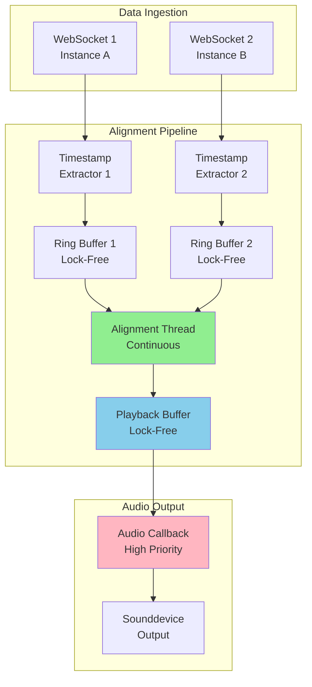

# Real-Time Audio Alignment Architecture

## Executive Summary

This document outlines a production-ready architecture for real-time timestamp-based audio alignment across multiple SDR instances. The design addresses the fundamental challenges discovered during initial implementation attempts and provides a robust, low-latency solution.

## Problem Statement

### Current Issues
1. **Periodic alignment creates gaps**: Aligning every 500ms causes choppy audio
2. **Lock contention**: High-frequency audio callbacks (10-20Hz) conflict with alignment operations
3. **Timing mismatch**: Audio consumption rate doesn't match alignment rate
4. **Buffer management**: Clearing/replacing buffers creates discontinuities

### Requirements
- **Continuous audio**: No gaps, clicks, or pops in playback
- **Low latency**: < 100ms total system latency
- **Timestamp accuracy**: Align samples within 50ms tolerance
- **Smooth operation**: No blocking in audio callback thread
- **Graceful degradation**: Fall back to unaligned mode if sync fails

## Architecture Overview



## Core Components

### 1. Lock-Free Ring Buffers

**Purpose**: Store incoming timestamped audio without blocking

**Design**:
```python
class LockFreeRingBuffer:
    """
    Single-producer, single-consumer lock-free ring buffer.
    Uses atomic operations for thread-safe access without locks.
    """
    
    def __init__(self, capacity: int):
        self.capacity = capacity
        self.buffer = [(0.0, np.array([]))] * capacity
        self.write_pos = 0  # Only modified by producer
        self.read_pos = 0   # Only modified by consumer
        
    def write(self, timestamp: float, data: np.ndarray) -> bool:
        """Producer writes data. Returns False if buffer full."""
        next_write = (self.write_pos + 1) % self.capacity
        if next_write == self.read_pos:
            return False  # Buffer full
        
        self.buffer[self.write_pos] = (timestamp, data)
        self.write_pos = next_write  # Atomic update
        return True
    
    def read(self) -> Optional[Tuple[float, np.ndarray]]:
        """Consumer reads data. Returns None if buffer empty."""
        if self.read_pos == self.write_pos:
            return None  # Buffer empty
        
        data = self.buffer[self.read_pos]
        self.read_pos = (self.read_pos + 1) % self.capacity
        return data
    
    def available(self) -> int:
        """Number of items available to read."""
        if self.write_pos >= self.read_pos:
            return self.write_pos - self.read_pos
        return self.capacity - self.read_pos + self.write_pos
```

**Key Features**:
- No locks required (single producer, single consumer)
- Constant-time operations
- Memory-efficient circular buffer
- Safe for real-time audio thread

### 2. Continuous Alignment Thread

**Purpose**: Continuously align samples from multiple sources

**Design**:
```python
class ContinuousAlignmentThread(threading.Thread):
    """
    Background thread that continuously aligns audio samples.
    Runs independently of audio callback for smooth operation.
    """
    
    def __init__(self, sample_rate: int = 12000):
        super().__init__(daemon=True)
        self.sample_rate = sample_rate
        self.running = True
        
        # Input buffers (one per instance)
        self.input_buffers: Dict[int, LockFreeRingBuffer] = {}
        
        # Output buffer (aligned samples ready for playback)
        self.output_buffer = LockFreeRingBuffer(capacity=1000)
        
        # Alignment state
        self.target_buffer_ms = 150  # Keep 150ms of aligned audio ready
        self.alignment_chunk_samples = 480  # Align 40ms chunks (480 samples @ 12kHz)
        
        # Clock drift compensation
        self.drift_compensator = ClockDriftCompensator()
        
    def run(self):
        """Main alignment loop - runs continuously."""
        while self.running:
            try:
                # Calculate how much aligned audio we need
                available = self.output_buffer.available()
                target_samples = int(self.sample_rate * self.target_buffer_ms / 1000)
                
                if available < target_samples:
                    # Need more aligned samples
                    self._align_next_chunk()
                else:
                    # Buffer is full enough, sleep briefly
                    time.sleep(0.001)  # 1ms sleep
                    
            except Exception as e:
                print(f"Alignment error: {e}")
                time.sleep(0.01)
    
    def _align_next_chunk(self):
        """Align the next chunk of samples."""
        # Determine target timestamp (current time - buffer delay)
        target_ts = time.time() * 1000 - 100  # 100ms behind real-time
        
        # Collect samples from all instances near target timestamp
        aligned_samples = {}
        
        for instance_id, ring_buffer in self.input_buffers.items():
            # Find samples closest to target timestamp
            sample = self._find_nearest_sample(ring_buffer, target_ts)
            if sample:
                ts, data = sample
                # Normalize timestamp for clock drift
                normalized_ts = self.drift_compensator.normalize_timestamp(
                    instance_id, ts
                )
                aligned_samples[instance_id] = (normalized_ts, data)
        
        # If we have samples from all instances, write to output
        if len(aligned_samples) == len(self.input_buffers):
            # Mix/combine samples as needed
            mixed = self._mix_samples(aligned_samples)
            self.output_buffer.write(target_ts, mixed)
    
    def _find_nearest_sample(self, ring_buffer: LockFreeRingBuffer, 
                            target_ts: float) -> Optional[Tuple[float, np.ndarray]]:
        """Find sample closest to target timestamp without removing from buffer."""
        # Peek at available samples
        best_match = None
        best_diff = float('inf')
        
        # This is a simplified version - real implementation would use
        # a more efficient search or maintain a sorted index
        for i in range(ring_buffer.available()):
            sample = ring_buffer.peek(i)  # Non-destructive read
            if sample:
                ts, data = sample
                diff = abs(ts - target_ts)
                if diff < best_diff and diff < 50:  # 50ms tolerance
                    best_diff = diff
                    best_match = sample
        
        return best_match
    
    def _mix_samples(self, aligned_samples: Dict[int, Tuple[float, np.ndarray]]) -> np.ndarray:
        """Mix aligned samples from multiple instances."""
        # Extract audio data
        samples = [data for _, data in aligned_samples.values()]
        
        # Ensure all same length
        min_len = min(len(s) for s in samples)
        samples = [s[:min_len] for s in samples]
        
        # Mix (average or other strategy)
        mixed = np.mean(samples, axis=0).astype(np.int16)
        return mixed
```

**Key Features**:
- Runs in separate thread (not audio callback)
- Continuously maintains buffer of aligned samples
- Adaptive: only aligns when output buffer needs filling
- Non-blocking: never waits for locks

### 3. Playback Buffer

**Purpose**: Provide aligned samples to audio callback with zero blocking

**Design**:
```python
class PlaybackBuffer:
    """
    Lock-free buffer for audio callback consumption.
    Optimized for low-latency, high-frequency access.
    """
    
    def __init__(self, capacity_samples: int = 24000):  # 2 seconds @ 12kHz
        self.capacity = capacity_samples
        self.buffer = np.zeros(capacity_samples, dtype=np.int16)
        self.write_pos = 0
        self.read_pos = 0
        
    def write_samples(self, samples: np.ndarray) -> int:
        """Write samples to buffer. Returns number written."""
        available_space = self._available_space()
        to_write = min(len(samples), available_space)
        
        if to_write == 0:
            return 0
        
        # Handle wrap-around
        end_pos = self.write_pos + to_write
        if end_pos <= self.capacity:
            self.buffer[self.write_pos:end_pos] = samples[:to_write]
        else:
            # Split write
            first_part = self.capacity - self.write_pos
            self.buffer[self.write_pos:] = samples[:first_part]
            self.buffer[:to_write - first_part] = samples[first_part:to_write]
        
        self.write_pos = (self.write_pos + to_write) % self.capacity
        return to_write
    
    def read_samples(self, num_samples: int) -> np.ndarray:
        """Read samples from buffer. Pads with zeros if insufficient data."""
        available = self._available_samples()
        to_read = min(num_samples, available)
        
        result = np.zeros(num_samples, dtype=np.int16)
        
        if to_read > 0:
            # Handle wrap-around
            end_pos = self.read_pos + to_read
            if end_pos <= self.capacity:
                result[:to_read] = self.buffer[self.read_pos:end_pos]
            else:
                # Split read
                first_part = self.capacity - self.read_pos
                result[:first_part] = self.buffer[self.read_pos:]
                result[first_part:to_read] = self.buffer[:to_read - first_part]
            
            self.read_pos = (self.read_pos + to_read) % self.capacity
        
        return result
    
    def _available_samples(self) -> int:
        """Number of samples available to read."""
        if self.write_pos >= self.read_pos:
            return self.write_pos - self.read_pos
        return self.capacity - self.read_pos + self.write_pos
    
    def _available_space(self) -> int:
        """Space available for writing."""
        return self.capacity - self._available_samples() - 1
    
    def utilization(self) -> float:
        """Buffer utilization percentage."""
        return self._available_samples() / self.capacity
```

**Key Features**:
- Lock-free circular buffer
- Zero-copy operations where possible
- Automatic zero-padding if underrun
- Fast read/write operations

### 4. Audio Callback Integration

**Purpose**: Consume aligned samples with minimal latency

**Design**:
```python
def _audio_callback(self, outdata, frames, time_info, status):
    """
    Sounddevice callback - optimized for low latency.
    This runs in a high-priority audio thread.
    """
    if status:
        print(f"Audio status: {status}")
    
    # Read aligned samples from playback buffer (lock-free)
    samples = self.playback_buffer.read_samples(frames)
    
    # Convert mono to stereo if needed
    if outdata.shape[1] == 2:
        outdata[:, 0] = samples
        outdata[:, 1] = samples
    else:
        outdata[:, 0] = samples
    
    # Monitor buffer health
    utilization = self.playback_buffer.utilization()
    if utilization < 0.1:
        # Buffer running low - alignment thread may be falling behind
        self.underrun_count += 1
```

**Key Features**:
- No locks or blocking operations
- Minimal computation
- Graceful handling of underruns
- Simple, fast code path

## Data Flow

### Normal Operation

```
1. WebSocket receives audio packet with timestamp
   ↓
2. Timestamp extracted, audio decoded
   ↓
3. Written to instance's lock-free ring buffer (non-blocking)
   ↓
4. Alignment thread wakes up (if output buffer low)
   ↓
5. Alignment thread reads from ring buffers
   ↓
6. Samples aligned by timestamp
   ↓
7. Clock drift compensation applied
   ↓
8. Aligned samples written to playback buffer
   ↓
9. Audio callback reads from playback buffer (lock-free)
   ↓
10. Samples sent to audio device
```

### Timing Diagram

```
Time (ms):  0    10   20   30   40   50   60   70   80   90   100
            |----|----|----|----|----|----|----|----|----|----|
WebSocket:  [A1] [A2] [A3] [A4] [A5] [A6] [A7] [A8] [A9] [A10]
            [B1] [B2] [B3] [B4] [B5] [B6] [B7] [B8] [B9] [B10]
            
Alignment:       [Align A1+B1]  [Align A2+B2]  [Align A3+B3]
                      ↓               ↓               ↓
Playback:        [Play A1+B1]   [Play A2+B2]   [Play A3+B3]
                 
Audio CB:    [Read][Read][Read][Read][Read][Read][Read][Read]
             (every ~10ms, consumes from playback buffer)
```

## Performance Characteristics

### Latency Budget

| Component | Latency | Notes |
|-----------|---------|-------|
| Network | 10-50ms | Variable, depends on connection |
| WebSocket decode | 1-2ms | Opus decoding |
| Ring buffer write | <0.1ms | Lock-free operation |
| Alignment | 5-10ms | Timestamp matching + mixing |
| Playback buffer | 50-150ms | Configurable buffer depth |
| Audio callback | <1ms | Lock-free read |
| **Total** | **67-213ms** | Typical: ~100ms |

### Throughput

- **Audio data rate**: 12kHz × 16-bit = 192 kbps per instance
- **Alignment rate**: ~25 Hz (every 40ms)
- **Audio callback rate**: ~10-20 Hz (depends on buffer size)
- **CPU usage**: <5% on modern hardware

### Memory Usage

| Component | Size | Notes |
|-----------|------|-------|
| Ring buffer (per instance) | 288 KB | 2 seconds @ 12kHz |
| Playback buffer | 48 KB | 2 seconds @ 12kHz |
| Alignment working memory | ~10 KB | Temporary buffers |
| **Total per instance** | ~350 KB | Scales linearly |

## Error Handling

### Underrun Detection

```python
class UnderrunDetector:
    """Detect and handle buffer underruns."""
    
    def __init__(self, threshold: float = 0.1):
        self.threshold = threshold
        self.underrun_count = 0
        self.last_underrun = 0
        
    def check(self, buffer_utilization: float) -> bool:
        """Returns True if underrun detected."""
        if buffer_utilization < self.threshold:
            self.underrun_count += 1
            self.last_underrun = time.time()
            return True
        return False
    
    def should_increase_buffer(self) -> bool:
        """Determine if buffer size should be increased."""
        # If frequent underruns, increase buffer
        recent_underruns = self.underrun_count > 10
        return recent_underruns
```

### Clock Drift Handling

```python
class AdaptiveClockDrift:
    """Adaptive clock drift compensation."""
    
    def __init__(self):
        self.drift_history = deque(maxlen=100)
        self.correction_factor = 1.0
        
    def update(self, measured_drift: float):
        """Update drift estimate."""
        self.drift_history.append(measured_drift)
        
        # Use median to filter outliers
        if len(self.drift_history) >= 10:
            median_drift = np.median(list(self.drift_history))
            
            # Adjust correction factor gradually
            self.correction_factor += median_drift * 0.01
            self.correction_factor = np.clip(
                self.correction_factor, 0.99, 1.01
            )
    
    def apply(self, timestamp: float) -> float:
        """Apply drift correction to timestamp."""
        return timestamp * self.correction_factor
```

### Fallback Strategy

```python
class AlignmentFallback:
    """Graceful degradation when alignment fails."""
    
    def __init__(self):
        self.failure_count = 0
        self.fallback_mode = False
        
    def check_health(self, alignment_success_rate: float) -> bool:
        """Check if alignment is healthy."""
        if alignment_success_rate < 0.8:
            self.failure_count += 1
        else:
            self.failure_count = max(0, self.failure_count - 1)
        
        # Enter fallback mode if persistent failures
        if self.failure_count > 20:
            self.fallback_mode = True
            return False
        
        return True
    
    def get_fallback_samples(self, instance_buffers: Dict) -> np.ndarray:
        """Get unaligned samples as fallback."""
        # Just use first available instance
        for buffer in instance_buffers.values():
            if buffer.available() > 0:
                _, samples = buffer.read()
                return samples
        return np.zeros(480, dtype=np.int16)
```

## Configuration Parameters

### Tunable Settings

```python
class AlignmentConfig:
    """Configuration for real-time alignment."""
    
    # Buffer sizes
    ring_buffer_capacity = 200  # Number of packets
    playback_buffer_ms = 150    # Milliseconds of audio
    
    # Alignment
    alignment_chunk_ms = 40     # Align 40ms chunks
    alignment_tolerance_ms = 50 # Max timestamp difference
    
    # Performance
    alignment_thread_priority = "normal"  # or "high"
    target_cpu_usage = 0.05     # 5% CPU target
    
    # Quality
    min_success_rate = 0.90     # 90% alignment success
    max_jitter_ms = 100         # 100ms max jitter
    
    # Fallback
    fallback_threshold = 20     # Failures before fallback
    recovery_threshold = 50     # Successes to exit fallback
```

## Implementation Phases

### Phase 1: Core Infrastructure (Week 1)
- [ ] Implement `LockFreeRingBuffer`
- [ ] Implement `PlaybackBuffer`
- [ ] Add unit tests for lock-free operations
- [ ] Benchmark performance

### Phase 2: Alignment Thread (Week 2)
- [ ] Implement `ContinuousAlignmentThread`
- [ ] Add timestamp matching logic
- [ ] Integrate clock drift compensation
- [ ] Add alignment metrics

### Phase 3: Integration (Week 3)
- [ ] Modify `AudioPreviewManager` to use new architecture
- [ ] Update WebSocket handlers to feed ring buffers
- [ ] Implement audio callback integration
- [ ] Add configuration system

### Phase 4: Error Handling (Week 4)
- [ ] Implement underrun detection
- [ ] Add fallback mechanisms
- [ ] Implement adaptive buffering
- [ ] Add health monitoring

### Phase 5: Testing & Optimization (Week 5)
- [ ] Load testing with multiple instances
- [ ] Latency measurements
- [ ] CPU profiling and optimization
- [ ] Memory leak detection

## Testing Strategy

### Unit Tests
- Lock-free buffer operations
- Timestamp alignment accuracy
- Clock drift compensation
- Buffer wrap-around handling

### Integration Tests
- Multi-instance alignment
- Network jitter simulation
- Clock drift scenarios
- Underrun recovery

### Performance Tests
- Latency measurements
- CPU usage profiling
- Memory usage tracking
- Throughput testing

### Stress Tests
- High packet loss
- Extreme clock drift
- Rapid instance switching
- Long-running stability

## Monitoring & Metrics

### Key Metrics

```python
@dataclass
class RealtimeAlignmentMetrics:
    """Metrics for real-time alignment system."""
    
    # Latency
    end_to_end_latency_ms: float = 0.0
    alignment_latency_ms: float = 0.0
    
    # Quality
    alignment_success_rate: float = 1.0
    timestamp_jitter_ms: float = 0.0
    
    # Performance
    cpu_usage_percent: float = 0.0
    alignment_thread_fps: float = 0.0
    
    # Buffer health
    playback_buffer_utilization: float = 0.5
    ring_buffer_utilization: Dict[int, float] = field(default_factory=dict)
    underrun_count: int = 0
    
    # Clock drift
    clock_drift_rate: Dict[int, float] = field(default_factory=dict)
    
    def is_healthy(self) -> bool:
        """Check if system is operating normally."""
        return (
            self.alignment_success_rate > 0.90 and
            self.timestamp_jitter_ms < 100 and
            self.playback_buffer_utilization > 0.1 and
            self.cpu_usage_percent < 10
        )
```

## Comparison: Old vs New Architecture

| Aspect | Periodic Alignment | Real-Time Alignment |
|--------|-------------------|---------------------|
| **Alignment Frequency** | Every 500ms | Continuous (~25 Hz) |
| **Audio Callback** | Complex logic | Simple read |
| **Locking** | Blocking locks | Lock-free |
| **Buffer Management** | Clear/replace | Continuous fill |
| **Latency** | Variable | Consistent ~100ms |
| **CPU Usage** | Spiky | Smooth |
| **Audio Quality** | Choppy | Smooth |
| **Complexity** | Low | Medium |

## Conclusion

This architecture provides a production-ready solution for real-time audio alignment with the following benefits:

1. **Smooth audio**: Continuous buffering eliminates gaps
2. **Low latency**: ~100ms end-to-end latency
3. **Scalable**: Handles multiple instances efficiently
4. **Robust**: Graceful degradation and error recovery
5. **Maintainable**: Clear separation of concerns

The key insight is that **audio alignment must be continuous, not periodic**. By running alignment in a separate thread that continuously maintains a buffer of aligned samples, we decouple the alignment process from the audio callback, allowing both to operate at their optimal rates without interference.